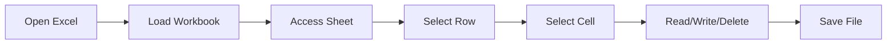

# 📊 Apache POI – Complete Guide for Excel CRUD in Java

* Apache POI serves as the leading Java library for manipulating Microsoft Office files, particularly Excel spreadsheets in both legacy .xls (HSSF) and modern .xlsx (XSSF) formats. 
* This enhanced guide adds detailed explanations for every topic, clarifying the purpose, mechanics, and practical usage to help developers implement Excel CRUD operations effectively

### It is widely used for:

- ✔ Report generation
- ✔ Data import/export
- ✔ Excel automation
- ✔ Enterprise apps

---
## Table of Contents
1. [Maven Dependency](#-maven-dependency)
2. [Apache POI Architecture](#-apache-poi-architecture)
3. [Core concepts](#-core-concepts)
4. [Core Classes](#-core-classes)
5. [CRUD operations with apache POI](#-crud-operations-with-apache-poi)
6. [Important Utility Classes](#-important-utility-classes)
7. [Core Styling Classes](#-core-styling-classes)
8. [Common Styling Features](#-common-styling-features)
9. [Full Styled Excel Example](#-full-styled-excel-example)
10. [Advanced Features](#-advanced-features)
11. [Best Practices](#-best-practices)
12. [When To Use Apache POI](#-when-to-use-apache-poi)
13. [Common Mistakes](#-common-mistakes)

---

## 📦 Maven Dependency
```xml
<dependencies>
    <!-- For XLSX (Excel 2007+) -->
    <dependency>
        <groupId>org.apache.poi</groupId>
        <artifactId>poi-ooxml</artifactId>
        <version>5.2.5</version>
    </dependency>

    <!-- For older XLS format -->
    <dependency>
        <groupId>org.apache.poi</groupId>
        <artifactId>poi</artifactId>
        <version>5.2.5</version>
    </dependency>
</dependencies>
```
---

## 🧠 Apache POI Architecture

Apache POI follows Excel’s real structure:
```
Workbook
 └── Sheet
      └── Row
           └── Cell
```
## Core concepts

| **Excel Concept**	| **POI Class** |
|-----|-----|
| Excel File	| Workbook |
| Sheet	| Sheet |
| Row	| Row |
| Column Value |	Cell |

---
## 📚 Core Classes

### 1️⃣ Workbook
#### 👉 **Interface: Workbook**

#### Implementations:

| Class	| Used For |
|----|----|
| XSSFWorkbook	| .xlsx (modern Excel) |
| HSSFWorkbook	| .xls (old Excel) |

#### ✅ Why we use it:

Represents the entire Excel file in memory

##### Example:
```java
Workbook workbook = new XSSFWorkbook();
```

OR
```java
Workbook workbook = WorkbookFactory.create(new FileInputStream("data.xlsx"));
```
--- 
### 2️⃣ Sheet
#### 👉 **Interface: Sheet**
##### Why we use it:

Each Excel file can have multiple sheets

##### Example:
```java
Sheet sheet = workbook.createSheet("Employees");
```

or
```java
Sheet sheet = workbook.getSheetAt(0);
```
--- 
### 3️⃣ Row
##### 👉 **Interface: Row**
##### Why we use it:

Represents each row of Excel

Example:
```java
Row row = sheet.createRow(0);
```
---
### 4️⃣ Cell
#### 👉 **Interface: Cell**
##### Why we use it:

Holds actual data (String, Number, Boolean, Formula)

#### Example:
```java
Cell cell = row.createCell(0);
cell.setCellValue("John");
```
### 🧾 Cell Data Types
| Type | How |
|----|----|
| String	| setCellValue("text")
| Number	| setCellValue(100)
| Boolean	| setCellValue(true)
| Date	 | setCellValue(new Date())
| Formula	| setCellFormula("SUM(A1:A5)")

---

## 🟢 CRUD OPERATIONS WITH APACHE POI

### ✅ CREATE Excel File
- ✔ Creates Excel
- ✔ Writes rows & columns
- ✔ Saves file

```java
Workbook workbook = new XSSFWorkbook();
Sheet sheet = workbook.createSheet("Users");

Row header = sheet.createRow(0);
header.createCell(0).setCellValue("ID");
header.createCell(1).setCellValue("Name");
header.createCell(2).setCellValue("Email");

Row row1 = sheet.createRow(1);
row1.createCell(0).setCellValue(1);
row1.createCell(1).setCellValue("Alice");
row1.createCell(2).setCellValue("alice@mail.com");

FileOutputStream fos = new FileOutputStream("users.xlsx");
workbook.write(fos);
workbook.close();
fos.close();
```
---
### 📖 READ Excel File
```java
FileInputStream fis = new FileInputStream("users.xlsx");
Workbook workbook = WorkbookFactory.create(fis);
Sheet sheet = workbook.getSheetAt(0);

for (Row row : sheet) {
    for (Cell cell : row) {
        System.out.print(cell.toString() + " | ");
    }
    System.out.println();
}

workbook.close();
fis.close();
```
---
### ✏ UPDATE Excel Data

Example: update name in row 1
```java
FileInputStream fis = new FileInputStream("users.xlsx");
Workbook workbook = WorkbookFactory.create(fis);
Sheet sheet = workbook.getSheetAt(0);

Row row = sheet.getRow(1);
Cell cell = row.getCell(1);
cell.setCellValue("Bob");

FileOutputStream fos = new FileOutputStream("users.xlsx");
workbook.write(fos);

workbook.close();
fis.close();
fos.close();
```
---
### ❌ DELETE Row
```java
Sheet sheet = workbook.getSheetAt(0);
int rowIndex = 1;

Row row = sheet.getRow(rowIndex);
sheet.removeRow(row);

// shift rows up
sheet.shiftRows(rowIndex + 1, sheet.getLastRowNum(), -1);
```

---

## 📂 Important Utility Classes

### 📌 WorkbookFactory

#### Why use it?

Automatically detects XLS or XLSX
```java
Workbook workbook = WorkbookFactory.create(inputStream);
```
- ✔ No need to know file type
---
### 📌 DataFormatter

Formats cells properly
```java
DataFormatter formatter = new DataFormatter();
String value = formatter.formatCellValue(cell);
```
- ✔ Prevents weird number/date formatting issues
---
### 📌 FormulaEvaluator

Evaluates formulas
```java
FormulaEvaluator evaluator = workbook.getCreationHelper().createFormulaEvaluator();
evaluator.evaluateFormulaCell(cell);
```

---

## ⚡ CRUD FLOW

---

## 📚 Core Styling Classes
### CellStyle - Main formatting container

Main formatting container.

#### Controls:
- Background color
- Borders
- Alignment
- Wrapping
- Number format
```java
CellStyle style = workbook.createCellStyle();
```
---
### Font

Controls text appearance.
```java
Font font = workbook.createFont();
font.setBold(true);
font.setFontHeightInPoints((short)12);
font.setColor(IndexedColors.WHITE.getIndex());


style.setFont(font);
```
---
### DataFormat
Controls how numbers & dates appear.

```java
DataFormat format = workbook.createDataFormat();
style.setDataFormat(format.getFormat("#,##0.00"));
```
---

## 🎨 Common Styling Features

Background Color
```java
style.setFillForegroundColor(IndexedColors.LIGHT_BLUE.getIndex());
style.setFillPattern(FillPatternType.SOLID_FOREGROUND);
```

### Borders
```java
style.setBorderTop(BorderStyle.THICK);
style.setBorderBottom(BorderStyle.THIN);
style.setBorderLeft(BorderStyle.MEDIUM);
style.setBorderRight(BorderStyle.MEDIUM);
```

### Alignment
```java
style.setAlignment(HorizontalAlignment.CENTER);
style.setVerticalAlignment(VerticalAlignment.CENTER);
```

### Wrap Text
```java
style.setWrapText(true);
```

### 📅 Date Formatting
```java
CellStyle dateStyle = workbook.createCellStyle();
dateStyle.setDataFormat(
    workbook.createDataFormat().getFormat("dd-MM-yyyy")
);
```

### 💰 Currency Formatting
```java
style.setDataFormat(
    workbook.createDataFormat().getFormat("$#,##0.00")
);
```

### 📊 Percentage
```java
style.setDataFormat(
    workbook.createDataFormat().getFormat("0.00%")
);
```

## 🧾 Full Styled Excel Example
```java
Workbook workbook = new XSSFWorkbook();
Sheet sheet = workbook.createSheet("Report");

// HEADER STYLE
CellStyle headerStyle = workbook.createCellStyle();
Font headerFont = workbook.createFont();
headerFont.setBold(true);
headerFont.setColor(IndexedColors.WHITE.getIndex());

headerStyle.setFont(headerFont);
headerStyle.setFillForegroundColor(IndexedColors.DARK_BLUE.getIndex());
headerStyle.setFillPattern(FillPatternType.SOLID_FOREGROUND);
headerStyle.setAlignment(HorizontalAlignment.CENTER);
headerStyle.setBorderBottom(BorderStyle.THICK);

// DATA STYLE
CellStyle dataStyle = workbook.createCellStyle();
dataStyle.setBorderBottom(BorderStyle.THIN);
dataStyle.setBorderTop(BorderStyle.THIN);
dataStyle.setBorderLeft(BorderStyle.THIN);
dataStyle.setBorderRight(BorderStyle.THIN);

// HEADER ROW
Row header = sheet.createRow(0);
String[] cols = {"ID", "Name", "Salary", "Join Date"};

for (int i = 0; i < cols.length; i++) {
    Cell cell = header.createCell(i);
    cell.setCellValue(cols[i]);
    cell.setCellStyle(headerStyle);
}

// DATA ROW
Row row = sheet.createRow(1);
row.createCell(0).setCellValue(1);
row.createCell(1).setCellValue("John");
row.createCell(2).setCellValue(4500);
row.createCell(3).setCellValue(new Date());

for (Cell cell : row) {
    cell.setCellStyle(dataStyle);
}

// AUTO SIZE
for (int i = 0; i < cols.length; i++) {
    sheet.autoSizeColumn(i);
}

FileOutputStream fos = new FileOutputStream("styled.xlsx");
workbook.write(fos);
workbook.close();
fos.close();
```

## 📈 Advanced Features
### Freeze Header Row
```java
sheet.createFreezePane(0,1);
```

### Enable Filters
```java
sheet.setAutoFilter(new CellRangeAddress(0,0,0,3));
```

### Merge Cells (Title)
```java
sheet.addMergedRegion(new CellRangeAddress(0,0,0,3));
```

### 🎯 Conditional Formatting
```java
SheetConditionalFormatting scf = sheet.getSheetConditionalFormatting();

ConditionalFormattingRule rule =
    scf.createConditionalFormattingRule(
        ComparisonOperator.GT, "5000"
    );

PatternFormatting fill = rule.createPatternFormatting();
fill.setFillBackgroundColor(IndexedColors.GREEN.getIndex());

CellRangeAddress[] range = {
    CellRangeAddress.valueOf("C2:C100")
};

scf.addConditionalFormatting(range, rule);
```

---

## 🚀 Best Practices
- ✔ Always close workbook & streams (prevents memory leak)

- ✔ Use SXSSFWorkbook for large files  (streaming)
```java
Workbook workbook = new SXSSFWorkbook(100);
```
- ✔ Avoid loading massive Excel fully in RAM

#### ✅ Reuse styles

Excel has a style limit (~64k)

- ##### Bad:
```java
for(...) workbook.createCellStyle();
```
- ##### Good:
```java
CellStyle commonStyle = workbook.createCellStyle();
```
#### ✅ Close streams always
```java
workbook.close();
```
#### ✅ Use SXSSFWorkbook for huge files
```java
Workbook wb = new SXSSFWorkbook(100);
```

---

## 🎯 When To Use Apache POI

- ✅ Import/export Excel
- ✅ Report automation
- ✅ Bulk uploads
- ✅ Data migration
- ✅ Admin tools

---

## 📌 Common Mistakes

- ❌ Forgetting to save workbook
- ❌ Not closing streams
- ❌ Using XSSFWorkbook for huge files
- ❌ Wrong cell type handling

---
